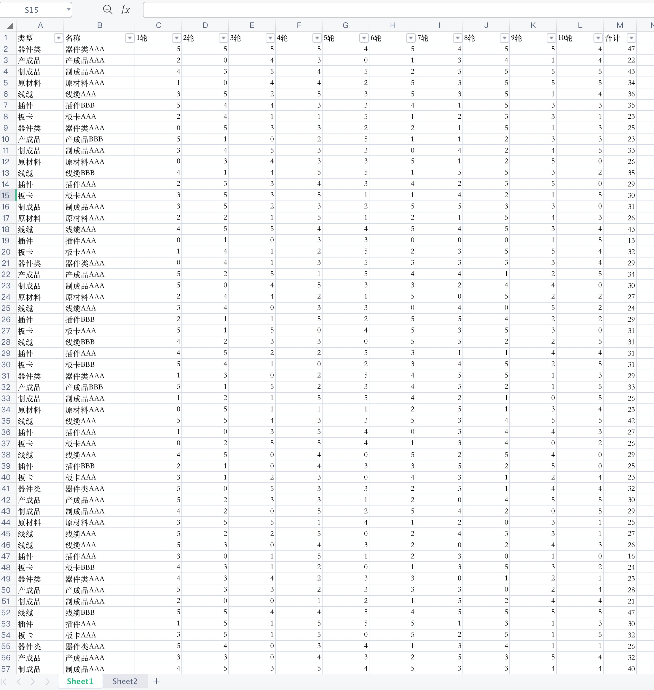
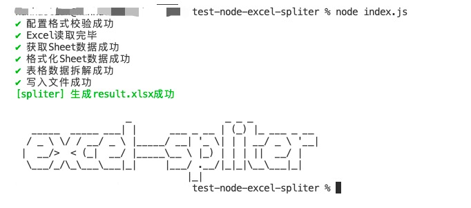
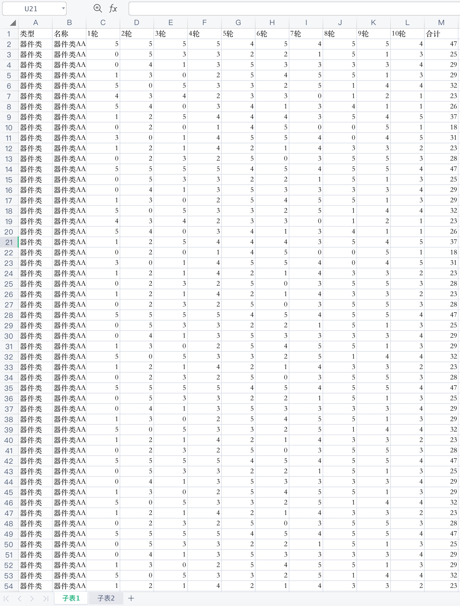

# node-excel-spliter

> Split Excel Files by custom search conditions running in NodeJS environment

> 根据自定义条件，批量拆解 Excel 表格的 NodeJS 小工具

## Install 安装

```
$ npm install node-excel-spliter
```

## Usage 使用方法

```js
const spliter = require("node-excel-spliter");
spliter.run({
  input: { path: "/Users/xxx/Desktop/测试.xlsx" },
  output: {
    path: "/Users/xxx/Desktop/output",
    outputType: "sheets",
    actions: {
      子表1: {
        search: [
          {
            col: "类型",
            value: "器件类",
          },
          {
            col: "名称",
            value: "器件类AAA",
          },
        ],
        count: {
          col: "合计",
        },
        sum: [
          {
            col: "1轮",
          },
          {
            col: "2轮",
          },
          {
            col: "3轮",
          },
          {
            col: "4轮",
          },
        ],
      },
      子表2: {
        search: [
          {
            col: "类型",
            value: "产成品",
          },
          {
            col: "名称",
            value: "产成品AAA",
          },
        ],
        count: {
          col: "合计",
        },
        sum: [
          {
            col: "1轮",
          },
          {
            col: "2轮",
          },
          {
            col: "3轮",
          },
          {
            col: "4轮",
          },
        ],
      },
    },
  },
});
```

## Demo 效果演示


原始 Excel 数据



脚本执行的过程


按条件查询并分割后的 Excel

## Configs Detail 配置参数说明

### input

Type: `object`

原始 Excel 文件相关的配置

### input.path

Type: `string`

原始 Excel 文件在磁盘中的绝对路径

### output

Type: `object`

输出的 Excel 文件相关的配置

### output.path

Type: `string`

输出的 Excel 目标文件夹在磁盘中的绝对路径

### output.path.outputType?

Type:`sheets|files`\
Default: `sheets`

值为 sheets 则在一个 Excel 文件中生成多个 sheet；值为 files 生成多个 Excel 文件

### output.path.actions

Type: `object`

对原始 Excel 的拆解规则

### output.path.actions.[sheet]

Type: `object`

在需要拆解生成的 sheets 下定义拆解规则

### output.path.actions.[sheet].[action]

Type: `search|count|sum`

`1.例如配置search.col=="类型"，search.value=="器件类"，则会根据“找到原始Excel中所有【类型】列的值为【器件类】的数据”，可配置多个搜索条件的并集`

`2.例如配置sum.col=="1轮"，则在完成表格拆解后，会自动计算所有数据【1轮】列的值的和，可配置多个列自动求和`

`3.例如配置count.col=="合计"，则在完成表格拆解后，会自动统计所有数据的条数，并写入在最后一条数据的【合计】列的下面`
